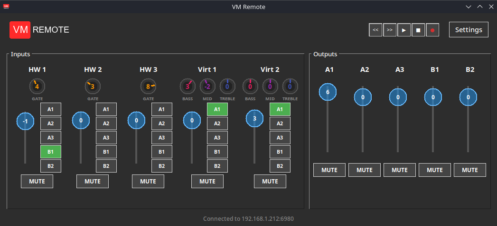

# VM Remote

Control Voicemeeter from your Steam Deck or Linux device via VBAN protocol.

A lightweight Python/Tkinter application that lets you remotely control Voicemeeter Banana/Potato from your Steam Deck in Desktop Mode. Adjust gain, mute channels, control routing (A1-A3, B1-B2), tweak EQ and Gate settings, and operate the tape recorder - all over your local network using VBAN text commands.




## Features

- 5 input strips (HW 1-3, Virtual 1-2) with gain sliders and routing buttons
- 5 output buses (A1-A3, B1-B2) with gain and mute
- Gate control for hardware inputs
- 3-band EQ (Bass/Mid/Treble) for virtual inputs
- Tape recorder transport controls
- Settings saved locally between sessions
- Dark theme optimized for Steam Deck display
- Scroll wheel support for fine adjustments

## Requirements

### On your Windows PC:
1. **Voicemeeter** (Banana or Potato) installed and running
2. **VBAN enabled** in Voicemeeter:
   - Open Voicemeeter
   - Click "Menu" → "VBAN - Virtual Audio Network"
   - In the "Incoming Streams" section, enable one stream
   - Set the stream name (default: "Command1")
   - Note your PC's IP address

### On your Steam Deck / Linux:
- Python 3 with Tkinter (pre-installed on Steam Deck)
- Optional: `python-pillow` for logo display

## Installation on Steam Deck

1. Switch to Desktop Mode

2. Open a terminal (Konsole) and run:
```bash
mkdir -p ~/voicemeeter-deck
cd ~/voicemeeter-deck
```

3. Download the files:
```bash
# Clone the repo or download these files:
# - voicemeeter_deck.py
# - logo.png
# - icon.png
```

4. (Optional) Install Pillow for logo support:
```bash
sudo pacman -S python-pillow
```

5. Run the app:
```bash
python3 ~/voicemeeter-deck/voicemeeter_deck.py
```

## Configuration

1. Click the **Settings** button in the app
2. Enter your Windows PC's IP address
3. Set the VBAN port (default: 6980)
4. Set the stream name (must match Voicemeeter's VBAN setting, default: "Command1")
5. Click **Save**

## Usage

### Inputs (Strips)
- **HW 1-3**: Hardware inputs with Gate control
- **Virt 1-2**: Virtual inputs with 3-band EQ (Bass/Mid/Treble)

### Outputs (Buses)
- **A1-A3**: Physical outputs
- **B1-B2**: Virtual outputs

### Controls
- **Sliders**: Drag or scroll wheel to adjust gain (-60 to +12 dB)
- **Routing buttons**: Toggle A1-A3, B1-B2 routing for each input
- **MUTE**: Toggle mute for any channel
- **Knobs**: Drag up/down or scroll wheel to adjust Gate/EQ
- **Tape recorder**: Control Voicemeeter's built-in recorder

## VBAN Protocol

This app uses VBAN-Text protocol to send commands to Voicemeeter over UDP.
Commands are sent as packets with format:
```
Strip[0].Gain=-10;
Bus[1].Mute=1;
Strip[0].A1=1;
```

## Troubleshooting

### "Not working" / No response
- Verify your PC's IP address is correct in Settings
- Check that Voicemeeter is running with VBAN enabled
- Ensure Steam Deck and PC are on the same network
- Check Windows firewall isn't blocking UDP port 6980

### Stream name mismatch
- The stream name in Settings must exactly match the VBAN incoming stream name in Voicemeeter

## License

MIT
